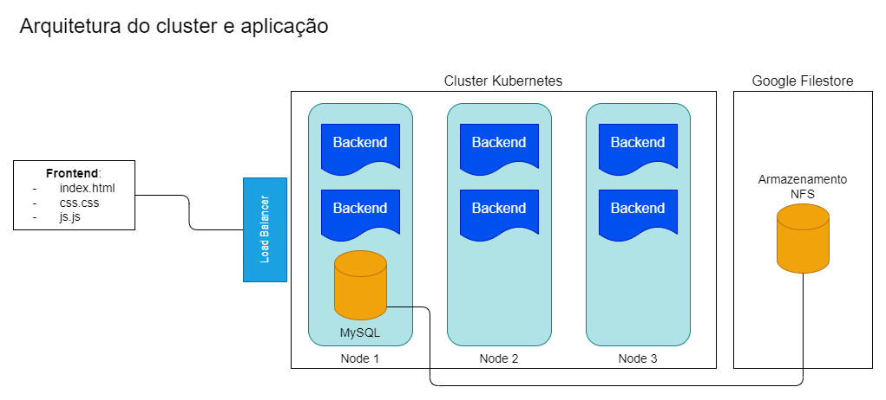

# Kubernetes - Projeto 1

## Deploy de uma aplicação completa

- O projeto tem como objetivo criar um cluster kubernetes para realizar o deploy de uma aplicação completa seguindo a arquitetura na imagem abaixo

## Observações

1. O projeto teve base este [repositório](https://github.com/denilsonbonatti/k8s-projeto1-app-base) e as aulas fornecidas pelo professor Denilson Bonatti, dono do repositóio.
2. A arquitetura original foi mantida, exceto no quesito armazenamento de dados, que no caso foi escolhida a solução de armazenamento NFS fornecida pelo Google Cloud tendo em vista uma maior persistência dos dados para uma aplicação real.
3. O front end foi mantido externo ao cluster pois em uma situação real, o front end poderia ser uma aplicação mobile, ou, caso fosse uma aplicação web, poderia rodar em poucos pods no cluster, já que a maior parte do processamento, logo, o maior consumo de recursos do cluster é feito pelo backend. Dessa forma, com a utlização do Load Balancer temos uma melhor distribuição dessa carga.
4. O parâmetro id na aplicação foi alterado de forma a ser gerado automaticamente no banco de dados, ao invés de ser gerado aleatoriamente no backend. Dessa forma, evita-se que dados sejam inseridos com o mesmo id.
5. Foi criado o arquivo de execução start.bat para inicialização do projeto no Windows e start.sh para o linux.
